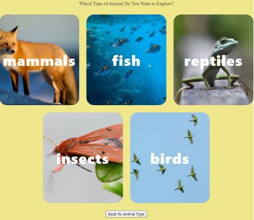

# Animal-app 

As a group, we must plan and develop an application that utilizes Wikipedia, Giphy, and Pixabay API’s to display animal related articles and images using dynamic html. 

## Requirements

* The project must be developed using a CSS framework other than Bootstrap, and must include at least two API's.

* The user must be able to click a highly visible and identifiable start button. 

* Then the user is presented with images and text representing various animal classes.

* When the user clicks on one of the images they are presented with another set of images and text representing various species in that class. 

* When an image is clicked, the user is presented with a Wikipedia article related to that species as well as several images. 

* The user also has the option to view previously searched animals and to start a new search. 

## Deployed Application Link

https://ratalla816.github.io/animal-app/

## Deployed Application Screenshot

#### acknowledgements

* Interactive Front-End Project - KU Coding Bootcamp, Module 8 
© 2021 Trilogy Education Services, LLC, a 2U, Inc. 
brand Confidential and Proprietary. All Rights Reserved.

#### MIT License

Copyright (c) 2021 Will Knowles, Rob Christopher Atalla, George Mendoza, Olugbenga Ojo 

Permission is hereby granted, free of charge, to any person obtaining a copy of this software and associated documentation files (the "Software"), to deal in the Software without restriction, including without limitation the rights to use, copy, modify, merge, publish, distribute, sublicense, and/or sell copies of the Software, and to permit persons to whom the Software is furnished to do so, subject to the following conditions:

The above copyright notice and this permission notice shall be included in all copies or substantial portions of the Software.

THE SOFTWARE IS PROVIDED "AS IS", WITHOUT WARRANTY OF ANY KIND, EXPRESS OR IMPLIED, INCLUDING BUT NOT LIMITED TO THE WARRANTIES OF MERCHANTABILITY, FITNESS FOR A PARTICULAR PURPOSE AND NONINFRINGEMENT. IN NO EVENT SHALL THE AUTHORS OR COPYRIGHT HOLDERS BE LIABLE FOR ANY CLAIM, DAMAGES OR OTHER LIABILITY, WHETHER IN AN ACTION OF CONTRACT, TORT OR OTHERWISE, ARISING FROM, OUT OF OR IN CONNECTION WITH THE SOFTWARE OR THE USE OR OTHER DEALINGS IN THE SOFTWARE.
